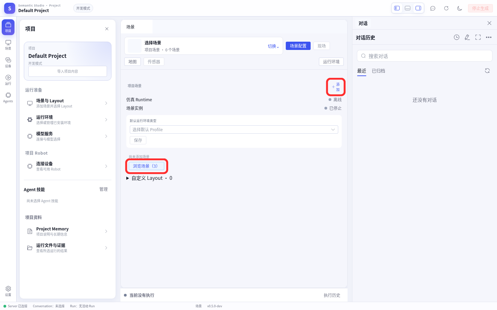
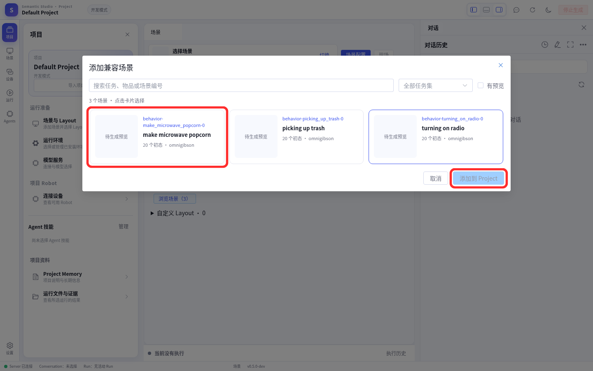
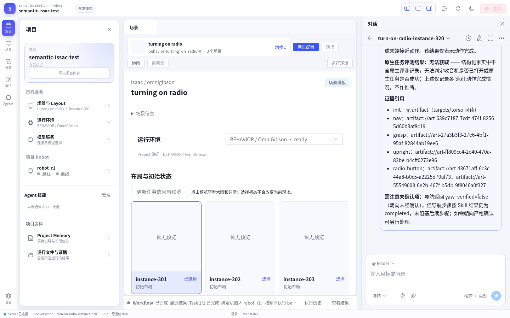

# BEHAVIOR (Isaac Sim) extension scenario — user manual

**English** | [简体中文](README.zh-CN.md)

BEHAVIOR is an embodied manipulation scenario built on Isaac Sim 5.1 / OmniGibson 3.9.2, with an
R1 Pro robot and the π0.5 policy. Unlike LIBERO it has **three prerequisites that no package can
carry**, and the user must prepare them or the scene will not start and the robot will not come
online:

| Prerequisite | Why it cannot ship | Who provides it |
|---|---|---|
| Engine image `behavior:v3.9.2` (31.1 GB) | it lives in the local Docker image store; the runtime consumes it via `docker run` | you (import or build) |
| Licensed dataset (29.3 GiB compressed / 32.4 GiB unpacked and up) | upstream third-party asset, non-commercial academic research only, not redistributed here | you (from the upstream channel) |
| π0.5 policy service (separate GPU process) | it is a separate inference service; it goes into neither the Isaac image nor the ability/Pilot environment | you (OpenPI plus the official radio weights) |
| LLM endpoint and key | required for Agent dialogue; the key ships in no package | you (into the Server `.env`) |

The installer's `prerequisites` only **probe** (a failure warns but does not block) and `post_install`
only **reminds**; the real preparation is in this manual, along one path:

```text
① Environment preparation → ② Install into the framework → ③ Reproduce in the web Studio
```

---

## 0. Order and overview

```text
① Hardware/dependency self-check (GPU, VRAM, disk, Docker, network, ports)
② Fetch the licensed dataset        → get the directory that --asset-root points at
③ Import/build the engine image     → behavior:v3.9.2 exists in the local Docker store
④ Prepare and start the π0.5 policy service → LISTEN on 20080 (★ must precede the four robot artifacts)
⑤ Configure the LLM key             → semantic-framework/.env
⑥ One-shot extension install        → install.sh --extension isaac
⑦ Post-install binding and acceptance → add the scene, bind ability/model, add a Pilot
```

Two ordering traps are easy to hit:

1. **Start π0.5 (step ④) before the four robot artifacts.** On startup the VLA ability connects to
   the policy service for one action-free warm-up; if it cannot connect it is never ready, and the
   four artifacts are unverifiable even after installation.
2. **Dataset unpack disk peak.** The main archive and its unpacked result occupy disk at the same
   time; `/tmp` plus the `--asset-root` volume need **≥ 70 GiB free** combined. Delete the archive
   after a successful unpack.

---

## 1. Environment preparation

### 1.1 Hardware and system prerequisites

| Item | Requirement | Symptom when missing |
|---|---|---|
| GPU | NVIDIA, discrete; **π0.5 needs ≥ 24 GB class VRAM**, the Isaac scene itself takes about 4.9 GB | π0.5 runs out of memory restoring weights |
| VRAM (previews only) | previews need ≥ 6144 MiB free; a 6 GB card can start a scene but previews always fail | preview reports insufficient VRAM; the installer skips previews automatically when free VRAM < 6144 MiB |
| Disk | ≥ 50 GiB free on the `--asset-root` and image-cache volume (dataset unpack peak needs ≥ 70 GiB more) | runtime reports "disk below 50 GiB, pausing Isaac start" |
| Docker | GPU-capable (`nvidia-container-toolkit`), can `docker run --gpus all` | containers do not start |
| Network | building the image needs `nvcr.io`, `repo.anaconda.com`, `developer.download.nvidia.com`, `pypi.org`, `pypi.nvidia.com`; dataset/weights per section below | build/download failures |
| Ports | see section 4 | port conflicts |

One-shot self-check:

```bash
nvidia-smi --query-gpu=index,memory.used,memory.free --format=csv   # pick a free card; previews need free >= 6144
docker info >/dev/null && echo "docker ok"
df -h /tmp .
```

### 1.2 Step 1: fetch the licensed dataset

The directory `--asset-root` points at must **contain** `2026-challenge-task-instances/` (i.e. point
at its parent). The dataset licence is **non-commercial academic research only**; fetching
`omnigibson.key` means accepting it.

**Three small packages (direct download is fine)**:

```bash
HF=https://hf-mirror.com/datasets/behavior-1k/zipped-datasets/resolve/main
export BEHAVIOR_DATA=/path/to/datasets        # the value of --asset-root at install time
mkdir -p "$BEHAVIOR_DATA"

curl -L --progress-bar -o /tmp/2026-challenge-task-instances.zip "$HF/2026-challenge-task-instances.zip"  # ~104 MB
curl -L --progress-bar -o /tmp/omnigibson-robot-assets-3.8.2.zip "$HF/omnigibson-robot-assets-3.8.2.zip"  # ~641 MB
unzip -q /tmp/2026-challenge-task-instances.zip -d "$BEHAVIOR_DATA/2026-challenge-task-instances"
unzip -q /tmp/omnigibson-robot-assets-3.8.2.zip -d "$BEHAVIOR_DATA/omnigibson-robot-assets"
curl -L --progress-bar -o "$BEHAVIOR_DATA/omnigibson.key" \
  https://storage.googleapis.com/gibson_scenes/omnigibson.key   # 44 B decryption key
```

**Main asset (29.3 GiB compressed, slow)**: first confirm `/tmp` and the `$BEHAVIOR_DATA` volume have
≥ 70 GiB free combined.

```bash
# either one; both resume
curl -L -C - --progress-bar -o /tmp/behavior-1k-assets.zip "$HF/behavior-1k-assets-3.9.0.zip"
aria2c -x8 -s8 -k1M -c -d /tmp -o behavior-1k-assets.zip "$HF/behavior-1k-assets-3.9.0.zip"   # multi-connection, faster
unzip -q /tmp/behavior-1k-assets.zip -d "$BEHAVIOR_DATA/behavior-1k-assets"
```

> For a progress bar use `-L --progress-bar` and **do not add `-s`** — `-s` silences the bar along
> with everything else, so a tens-of-gigabytes download looks stuck. If it drops, re-run the same
> command to resume. After a clean unpack you can delete `/tmp/behavior-1k-assets.zip` to reclaim
> 29.3 GiB.

**Verify**:

```bash
cat  "$BEHAVIOR_DATA/behavior-1k-assets/VERSION"                                     # expect 3.9.0
test -f "$BEHAVIOR_DATA/2026-challenge-task-instances/metadata/available_tasks.yaml" && echo "task metadata ready"
test -f "$BEHAVIOR_DATA/omnigibson.key"                                              && echo "decryption key ready"
```

### 1.3 Step 2: engine image `behavior:v3.9.2`

The runtime runs it by **full digest** (the `image` field of `runtime-settings.json`, pinned to
`sha256:fd750409…` for packages published on this channel) and **will not pull it for you**. The image
matching that digest must already exist in the local Docker store.

#### Option A: import the maintainer-provided archive (recommended, same digest)

```bash
docker load -i behavior-v3.9.2.tar            # archive provided by the distributor
docker image inspect behavior:v3.9.2 --format '{{.Id}}'
# expected: sha256:fd75040906f3270dc2e79aa306847c5be39b7ae20c4cbd4d219d5625afc6caa7
```

#### Option B: build from upstream sources

Upstream `BEHAVIOR-1K`'s `docker/Dockerfile` is the only build input. Note that **a self-built image
always has a different digest** (see "pinning identity").

```bash
export BEHAVIOR_ROOT=/path/to/BEHAVIOR-1K
git clone --depth 1 --branch v3.9.2 https://github.com/StanfordVL/BEHAVIOR-1K.git "$BEHAVIOR_ROOT"
git -C "$BEHAVIOR_ROOT" describe --tags                       # expect v3.9.2

cd "$BEHAVIOR_ROOT"
docker build -f docker/Dockerfile -t behavior:v3.9.2 .        # do not add --progress=plain
docker image inspect behavior:v3.9.2 --format '{{.Id}}'       # note the local digest
```

- The build context is that source tree; the repository's `.dockerignore` already excludes `datasets/*`
  and `.git`, so unpacking the dataset under it does not affect the build.
- It pulls more than ten GB of Isaac Sim 5.1 pip packages and compiles curobo; normally about half an
  hour, hours on a slow link.
- Clone the engine source to `$BEHAVIOR_ROOT` **before** unpacking the dataset to
  `$BEHAVIOR_ROOT/datasets`: the other order makes `git clone` fail because the target directory is not
  empty (workaround: rename the data directory away, clone, then move it back).

#### Pinning identity (required for self-built images)

Before starting, the runtime checks that the `image` in `runtime-settings.json` exists locally. A
self-built digest differs from the published fixed value, so the runtime cannot find the image at
startup. Write the local digest back into the `image` field of the runtime's `runtime-settings.json`
(that field is the only home of the digest), then reinstall or restart the runtime:

```bash
IMG=$(docker image inspect behavior:v3.9.2 --format '{{.Id}}')   # sha256:<64 hex>
echo "$IMG"
# edit runtime-settings.json in the unpacked runtime directory, set image to $IMG
# then reinstall the runtime (semanticctl runtime install ...) or restart it
```

> If your installer verifies that file and forbids in-place edits, use the "repackage the runtime"
> path instead: change `image` in the runtime source and **bump the version** (same name and version
> with different content is rejected by the installer). This is why option A is preferred.

**Verify**:

```bash
docker image inspect behavior:v3.9.2 --format '{{.Id}}'   # digest must match the image field in runtime-settings.json
```

### 1.4 Step 3: π0.5 policy service

The actual inference runs in a **separate GPU policy service** that you prepare, and it **must start
before the four robot artifacts**. The model component (`r1pro-radio-model-0.1.1`) only stores the
connection and mapping: `endpoint = ws://127.0.0.1:20080`, `actions_per_chunk = 16`.

| Item | Source | Key constraint |
|---|---|---|
| OpenPI environment | the fork `wensi-ai/openpi`, branch `behavior`, named by the official baselines | must be able to `import openpi.configs.tasks`, `openpi.serving.websocket_b1k_server`, `openpi.shared.eval_b1k_wrapper`; upstream `Physical-Intelligence/openpi` raises ImportError |
| π0.5 weights | row `turning_on_radio` in the "Provided checkpoints" table of `docs/challenge/baselines.md` in the BEHAVIOR-1K repository (Google Drive file id `1KojwNUz0HVwU3Ww2SVh3NKt-4asuI3y2`) | must contain `params/` and `assets/turning_on_radio/norm_stats.json`; `pi05_base` alone is not the same model |
| Launcher scripts | provided by the R1 Pro **BEHAVIOR ability** source: `scripts/serve_behavior_policy.py`, `scripts/behavior_policy_chunk.py` | not part of the six extension artifacts; get them from the same channel as that ability source |
| GPU | a separate process running alongside Isaac | π0.5 is about 3B parameters and needs ≥ 24 GB class VRAM |

```bash
export OPENPI_ROOT=/path/to/openpi
export PI05_CHECKPOINT=/path/to/pi05_turn_on_the_radio
mkdir -p "$(dirname "$OPENPI_ROOT")" "$(dirname "$PI05_CHECKPOINT")"

# 1) OpenPI source (must be the fork and branch named by the baselines)
git clone --branch behavior https://github.com/wensi-ai/openpi.git "$OPENPI_ROOT"
git -C "$OPENPI_ROOT" submodule update --init --recursive

# 2) separate uv environment (GIT_LFS_SKIP_SMUDGE=1 is required)
cd "$OPENPI_ROOT"
GIT_LFS_SKIP_SMUDGE=1 uv sync
source .venv/bin/activate
GIT_LFS_SKIP_SMUDGE=1 uv pip install -e .

# 3) fetch weights (Google Drive id above)
#    drive.google.com is often unreachable from mainland China; either:
#    A) use a proxy
uvx gdown --proxy http://<your-proxy> 1KojwNUz0HVwU3Ww2SVh3NKt-4asuI3y2 -O /tmp/pi05_turn_on_the_radio.zip
unzip -q /tmp/pi05_turn_on_the_radio.zip -d "$PI05_CHECKPOINT"
#    B) reuse a copy already downloaded on this host/LAN (inference only needs params/ and assets/)
#       find / -maxdepth 8 -type d -name "pi05_turn_on_the_radio" 2>/dev/null

# 4) verify
ls "$PI05_CHECKPOINT" | tr '\n' ' '; echo            # expect params and assets directly
test -f "$PI05_CHECKPOINT/assets/turning_on_radio/norm_stats.json" && echo "weights complete"

# 5) start (separate, long-lived terminal; must run inside the OpenPI environment)
nvidia-smi --query-gpu=index,memory.free --format=csv          # pick a free card first, e.g. index 3
cd "$OPENPI_ROOT"
CUDA_VISIBLE_DEVICES=3 \
XLA_PYTHON_CLIENT_PREALLOCATE=false XLA_PYTHON_CLIENT_MEM_FRACTION=0.3 \
  .venv/bin/python /path/to/r1pro-ability/scripts/serve_behavior_policy.py \
  --checkpoint "$PI05_CHECKPOINT" --action-horizon 16 --port 20080

ss -ltnp | grep ':20080'                             # LISTEN means it is up
```

Key points:

- `--action-horizon 16` must match the model configuration's `actions_per_chunk: 16`, and `--port`
  must match the model configuration's `endpoint` (both `20080`). Changing only one side looks like
  "the service listens on 20080 but the ability connects to 18080" and the robot is never ready.
- **Pin one free card explicitly**: `CUDA_VISIBLE_DEVICES` overrides the inherited value; `pi05_b1k`
  has `fsdp_devices=1`, so each visible card gets a full model copy and one busy visible card causes a
  global OOM.
- If the same service is already running, reuse it; do not start a second one.
- **A 6 GB card cannot run this step**: the Isaac scene already takes about 4.9 GB and the π0.5
  weights exceed 6 GB — a hardware limit, not a configuration issue.

### 1.5 Step 4: LLM key

Scene browsing and bringing the robot online do not need an LLM; driving the Agent through dialogue
does. Keys are named per "service" and written to the Server working directory's `.env` (loaded at
startup, the log prints `.env 已加载`):

```bash
# semantic-framework/.env — key rule: SEMANTIC_LLM_API_KEY_<NAME UPPERCASE, '-' to '_'>
SEMANTIC_LLM_API_KEY_DEEPSEEK_CHAT=<real key>
```

`.env` is not versioned and keys are copied into no component package or Bundle, so a new machine must
be configured again. Without a key only the `mock` endpoint is available, and mock only proves the
plumbing works — it is not task acceptance.

---

## 2. Install into the framework

Same entry script as the base install; it continues into the extension once the base environment is
ready:

```bash
curl -fsSL https://semantic.insightos.cn/install.sh | bash -s -- \
  --extension isaac --extension-project <PROJECT-ID> \
  --extension-asset-root /path/to/datasets --install-system-deps
```

| Flag | Purpose |
|---|---|
| `--extension isaac` | select the scenario (required) |
| `--extension-asset-root <abs-path>` | a **hard requirement** of the BEHAVIOR runtime: the `$BEHAVIOR_DATA` from 1.2, whose parent contains `2026-challenge-task-instances/` |
| `--extension-project <PROJECT-ID>` | target project; defaults to the current user's Default Project |
| `--extension-source oss\|github` | channel, default `oss`; all six BEHAVIOR artifacts are below 2 GiB, so the GitHub channel mirrors fully |
| `--extension-package-dir <dir>` | install **fully offline** from the six artifacts plus the manifest |
| `--extension-dry-run` | print the command plan without changing anything |
| `--no-previews` | skip preview generation (for `semanticctl extension install`); via `install.sh`, previews are skipped automatically when free VRAM < 6144 MiB |

- Confirm the image from 1.3 and the policy service from 1.4 are ready first; a `probe` failure warns
  but does not block.
- The extension runtime pack's declared `license` is added from the manifest
  (`--accept-license behavior-assets`).
- Fixed order: runtime → scene catalog → robot base → ability → model → skill.
- An offline install (`--extension-package-dir` or `--extension-manifest`) needs a manifest whose
  digests have been **backfilled**: the channel artifacts, or a staging tree produced by
  `artifacts/build_extension.py`. The `extensions/isaac/extension.json` in this repository is a
  **build template** with all-zero `sha256`; the installer rejects it up front with
  "manifest still carries placeholder sha256" instead of downloading and failing digest by digest.
- The disk probe is evaluated against this run's `--asset-root`: the manifest `check` writes
  `{asset_root}` and the installer substitutes it before running. With no `--asset-root` the row is
  reported as `skip` (the current directory is no longer used as a stand-in for the asset disk).

With the base environment already installed:

```bash
semanticctl extension install isaac --project <PROJECT-ID> --asset-root /path/to/datasets
```

> If `semanticctl` is not on your PATH, first `export PATH="$HOME/.local/share/semantic/bin:$PATH"`
> (use your actual dir when you passed `--dir`); the base install prints these two lines and tells you
> to persist them. See the entry point.

---

## 3. Reproduce in the web Studio

Sign in to the web Studio as `admin` (default `http://127.0.0.1:3000`) and open the target project.
Three things must be done in the web UI (the same as LIBERO), or the scene never enters the project and
the robot never comes online.

### 3.1 Scene configuration → add a compatible scene

Installation only registers the scene in the **scene catalog**; it does not add it to the project. In
Studio, open **Scene → Project scenes** and click **Add** (or **Browse scenes** when the panel is
empty):



In the **Add compatible scene** dialog, click a scene card (recommended: `turning on radio`), then
**Add to Project**:



After adding, the scene panel shows the runtime as `BEHAVIOR / OmniGibson` and the initial states of
`turning on radio`:



**Done when**: the scene is listed under **Project scenes** with runtime `BEHAVIOR / OmniGibson`.

### 3.2 Project content → bind the ability and model

Installation **imports** the ability and model into the project but **does not bind them to the
robot**. Without binding, the ability stays in `Standby` (`abilityPort: 0`) until it times out, the
Pilot stays `offline`, and the device page shows no executable robot.

1. In Studio, open **Project → Import project content** and scroll the dialog to the **Robot and
   model configuration** section at the bottom:

   

2. On the `r1pro` card, click **Select ability / model** (to make the current choice the default for
   future robots instead, click **Set project default** in the top right);
3. In the dialog choose, in order, **robot model** `r1pro` → **ability (one implementation per
   role)** → **policy model** (`0.1.1`, i.e. `r1pro-radio-model-0.1.1`), then click **Save binding**;
4. Back on that robot's card, click **Apply now / retry** — this **stops and restarts that robot's
   components once** (the scene keeps its current state), so confirm the robot is idle first.

**Done when**: the card's "pending configuration" and "running model" agree and it no longer sits in
`Standby`. A project default only applies to **future first-time bindings**; each robot's own choice
is stored independently.

> **π0.5 must be up first.** On startup the policy ability connects to `ws://127.0.0.1:20080` for one
> action-free warm-up (see 1.4); if it cannot connect it is never ready, so even a correct binding
> here leaves the robot offline.

### 3.3 Device centre → add a Pilot

**Device centre** is the global view of robots, and a fresh environment has an empty device list.
Note that **"Add Pilot" does not add a robot directly**: it only mints a one-time join code, and the
robot is registered only after you run the launcher on the **robot host** and the launcher exchanges
that code for a credential.

1. Open **Device centre** from the top menu and click **Add Pilot**:

   

2. The dialog shows a **one-time join code** (6 digits, valid about 5 minutes, claimable only once)
   and a launcher command; click **Copy command** to take both:

   

3. On the **robot host**, run that command in the foreground and keep it running (replace
   `<robot-id>` with the actual robot):

   ```bash
   semantic-robot-instance start --config /etc/semantic/robots/<robot-id>/robot-deployment.yaml --join-code <JOIN-CODE>
   ```

   The launcher discovers the Server over the LAN (mDNS service `_semantic-server._tcp`; mDNS is
   often unavailable on container networks, so you may append
   `--server-http http://<server>:8034 --server-ws ws://<server>:8035/ws/pilot`), exchanges the join
   code for that Pilot's dedicated credential and stores it on the robot host (in the instance
   directory's `connection.yaml`, mode `0600`), then starts **AbilityFramework → the seven ability
   classes → Pilot** in order, after which the Server reconciles and dispatches the expected robot
   skill.

4. Back in the dialog, click **Done** — it only closes the dialog; pairing completed the moment the
   launcher claimed the join code. After a moment the robot should appear in the device list with
   connection **online**.

Restarting the robot afterwards **no longer needs a join code** (the credential is already on the
robot host):

```bash
semantic-robot-instance start --config /etc/semantic/robots/<robot-id>/robot-deployment.yaml
```

> **Two Server settings** (`semantic-framework/.output/configs/semantic-server.yaml`, restart after
> editing): `robot_runtime.enabled: true` — otherwise the device page always shows "this project has no
> connected Robot"; and `robot_runtime.data_root` / `bundles_dir` must be **absolute paths** — they are
> copied verbatim into install receipts and venv forwarder scripts, and relative paths keep the managed
> robot from starting.

### 3.4 Acceptance

1. the scene is under **Project scenes**, `turning on radio` has selectable initial states and starts;
2. the robot appears in **Device centre** with connection **online** and a status other than `degraded`;
3. drive the Agent through **dialogue** to run the radio task (needs the LLM key from 1.5); the
   prompts to paste and how to read the result are in section 7.

---

## 4. Port table (defaults on a new machine never conflict; nothing needs changing)

| Purpose | Default | Decided by |
|---|---|---|
| Server HTTP / WS | `8034` / `8035` | `http_addr` / `ws_addr` in `semantic-server.yaml` (prebuilt-install defaults) |
| Web front end | `3000` | `semantic-web/vite.config.js` |
| BEHAVIOR runtime | `18090` | `install.sh --extension` (manifest `runtime.endpoint`) |
| Ability range | `18100–18199` | `ability_port_first` / `ability_port_last` in `semantic-server.yaml` |
| π0.5 policy service | `20080` | the `--port` from 1.4, which must equal the model configuration's `endpoint` |
| LIBERO runtime | `8092` | LIBERO manifest (can coexist with BEHAVIOR) |

A prebuilt install defaults to HTTP/WS `8034` / `8035`; a **source build** (`build.sh` /
`semantic_installer.py`) defaults to `8080` / `8081` (`SERVER_HTTP` / `SERVER_WS`). Only the defaults
differ — an existing instance always keeps its **configured** ports and never migrates when the
defaults change, so check which install path you are on before comparing port numbers.

When BEHAVIOR and LIBERO run on one host, both default to `18100–18199`; give each environment its own
range or you will see `http server bind ... failed`.

---

## 5. Troubleshooting

| Symptom | Cause and fix |
|---|---|
| `Runtime install failed: Runtime Pack requires content behavior_data, provide a path at install time` | almost always an empty `--extension-asset-root` (the variable was not exported), not a broken package |
| `docker: Error response from daemon: No such image: sha256:fd750409…` | the digest is not in the local store, see 1.3 |
| `Runtime … still has an active scene, stop the scene first` | the runtime port is held by another checkout; change `--endpoint` or stop that scene |
| Preview reports insufficient VRAM / `ran out of memory ... requested by op` | previews need ≥ 6144 MiB free; policy-service OOM is usually a busy visible card, pin a free one per 1.4 |
| Disk below 50 GiB, Isaac start paused | clear the image cache or the `--asset-root` volume, keep ≥ 50 GiB |
| The robot stays `offline` / the ability stays `Standby` | π0.5 was not started first, or the port / `--action-horizon` disagrees with the model configuration, or the ability/model were not bound |
| The project does not show the scene | the compatible scene was never added |

---

## 6. Uninstall

Stop the scene and the robot first, then remove the extension. The base environment's native-mujoco
runtime is unaffected:

```bash
semanticctl extension remove isaac
```

---

## 7. Task reproduction: dialogue prompts and reading results

With the prerequisites ready (section 1), the extension installed (section 2) and the three web steps
done (section 3), running a task means **pasting one whole prompt into the web dialogue page**. This
section gives the two prompts you can copy verbatim, how scenes map to instances, and how to read the
result.

### 7.1 Reproduction flow

```text
1 Prerequisites ready   engine image behavior:v3.9.2 / licensed dataset (--asset-root) / pi0.5 policy service (:20080) / LLM key (.env)
2 Start the scene       start one native instance of the BEHAVIOR scene (301-320)
3 Open the dialogue page  open an Agent session in the web Studio
4 Send the prompt       paste the whole text from 7.3 / 7.4 as a single message
5 Wait for the task state  completed / failed / error
6 Read and record       success = ok; on failure capture stage + error code/cause + multi-angle photos, into the table in 7.7
```

Two ordering traps:

1. **The pi0.5 policy service must start before the four robot artifacts** (same as 1.4 and 3.2): on
   startup the VLA ability connects to it for one action-free warm-up, and if it cannot connect it is
   never ready, so the four artifacts stay unverifiable.
2. **Run a whole task chain on one scene instance before switching instances**: switching mid-chain
   makes "stage / error code" incomparable.

### 7.2 Scenes and instances

- The radio task's `scene_id` is `behavior-turning_on_radio-0` (display name `turning on radio`).
  `--scene` only accepts a `scene_id`; a display name matches nothing. The manifest pins the default
  scene to this value (section 2).
- A scene directory holds 7 tasks and each task has 20 native instances (`instance-301` … `instance-320`).
  Results are counted per instance, so **note the instance number before every run**.
- VRAM: previews need >= 6144 MiB free; a 6 GB card can start a scene but previews always fail, so
  install with `--generate-previews=false` (via `install.sh` they are skipped automatically).

### 7.3 Prompt one: turn on the radio

**How to use it**: open the web dialogue page (an Agent session) and paste the whole block below **as a
single message**; do not split it and do not rewrite the parameters. The text hard-codes three things,
which is exactly what makes the result reproducible: it binds the robot `robot_r1`; it names the Robot
Skill and the full JSON input for every step; and each step runs only after the previous one succeeded -
on failure or pause it stops, never retries, never edits parameters and never resets the scene.

**It does not distinguish left from right hand** (the skill works out which hand grasps and which hand
operates), so copy this block as-is:

> The prompt body is Chinese and must be pasted **verbatim** - translating it would change the task the
> Agent receives.

```text
创建一个任务，绑定机器人 robot_r1，依次完成：
初始化 → 导航到收音机附近 → 抓取收音机并抬升 → 调整躯干位置 → 打开收音机。

依次使用 behavior-init、behavior-nav、behavior-grasp、behavior-upright、
behavior-radio-button 五个 Robot Skill。

每一步成功后才能进入下一步。失败或暂停时保留执行结果，
报告具体阶段、错误码和原因，停止后续步骤。
Task 不自动重试 Skill，不修改输入参数。

不查询语义地图。机器人状态、目标位置和场景观测，
由 Robot Agent 通过已有能力获取。

第一步：初始化

调用 behavior-init，输入：
{"arm_posture": "raised"}

Skill 根据当前躯干状态计算双臂准备姿态的末端目标，
左右手分别通过一次末端 IK 动作完成初始化。

第二步：导航到收音机附近

调用 behavior-nav，输入：
{
  "object_name": "radio_89",
}

目标位置和朝向由导航能力根据当前实例计算。
直接使用计算出的站位
以导航执行和到达检查结果判定本步骤是否成功。

第三步：抓取收音机并抬升

调用 behavior-grasp，输入：
{
  "object_ref": "radio_89",
  "side": "auto",
  "prompt": "red radio handle",
  "approach_preference": "downward",
  "grasp_offset_m": [0.0, 0.0, 0.0],
  "liftoff_height_m": 0.005,
  "opening_m": 0.05,
  "maximum_force_n": 50.0
}


按当前 Skill 的两阶段姿态流程执行：
1. 根据当前状态和相机标定计算观察姿态，调整躯干。
2. 视觉识别收音机，取得本次抓取中心。
3. 根据识别目标联合计算躯干和手臂的操作姿态，
   单次调整躯干，再按实测关节校验抓取路径。
4. 接近、闭爪确认、抬升。

识别后保持底盘不动，沿用识别得到的 body 坐标。
操作姿态允许四个躯干关节参与求解。

自动朝向使用收音机把手延长方向与世界竖直方向构成的平面：
允许腕部相机光轴在该平面内俯仰，夹爪延伸方向允许倾斜；
按 Skill 规则保持相机安装侧朝身体内侧。
不指定固定四元数，也不额外要求夹爪竖直向下或开合轴严格垂直把手。

坐标与参数：
- grasp_offset_m 使用物体局部坐标，叠加到视觉识别中心。
- pregrasp_offset_m 和 lift_offset_m 使用世界坐标。
- 预抓取点在抓取点上方 10 cm，抬升终点在抓取点上方 12 cm。
- opening_m 为平均单指行程，预张开 0.05 m。
- maximum_force_n 为最大夹持力
- 闭爪成功且接触结果匹配本次目标和候选后，才执行抬升。
- timeout_seconds 为每个 Action 的超时预算。
- speed_rad_s 为调整躯干时的速度限制

保留以上数值，坐标转换、姿态和路径计算均由 Skill 完成。
第四步：调整躯干状态
调用 behavior-upright，输入：
  {
    "timeout_seconds": 150
  }

将躯干恢复到 Skill 定义的原生初始姿态。
使用 Skill 内置的平滑轨迹及速度、加速度限制，
根据实际关节位移计算运动时长，等待回读确认到位后进入抓取。
已经处于目标容差内时，允许 Skill 跳过运动并完成复核。

第五步：操作收音机按钮

仅在抓取并抬升成功后调用 behavior-radio-button，输入：
{
  "button_prompt": "red button",
}


允许该 Skill 内置的单次翻转流程：
首次未找到按钮时，持物手轴向翻转，再计算观察位并识别一次。
传感器错误、运动失败或第二次识别失败时停止。
Task 不额外重跑 Skill 或修改参数。

最终报告：
- 五个步骤各自的执行状态。
- 失败或暂停的阶段、错误码和原因。
- 抓取接触确认及抬升结果。
- 按钮识别、翻转和接近动作结果。
- 原生任务评测结果；无法获取时明确报告“无法获取”。

Skill 动作完成与原生任务成功分别记录，
不得根据动作完成情况推断收音机已经打开或原生任务已经成功。
```

### 7.4 Prompt two: throw three soda cans

**The can colours must be supplied** (113 blue, 114/115 orange); copy this block as-is:

```text
创建一个任务，绑定机器人 robot_r1，以下七步作为模板，依次对 113、114、115 各执行一轮。仅将导航、抓取、放置中的罐子引用替换为当前对象；113 的 prompt 使用 "blue soda can"，114/115 使用 "orange soda can"。其余参数不变。
**初始化 → 导航到易拉罐附近 → 抓取并抬升至持物位 → 恢复直立 → 导航到垃圾桶附近 → 从上方投放 → 恢复直立。**
使用已有的 behavior-init、behavior-nav、behavior-grasp、behavior-upright、behavior-place Robot Skill，严格按以下顺序执行。
每一步成功后才能进入下一步。任一步失败或暂停时，保留执行结果并报告原因，停止后续步骤，不自动重试、不修改参数。
机器人状态、目标几何和场景观测由 Robot Agent 通过自身能力获取。严格使用各步骤给出的 JSON 输入；唯一的运行时数据补充是第六步的 object_size_m 和 eef_from_object，必须从本轮、当前同一罐子的第三步 behavior-grasp 成功结果中原样获取并传入。除此之外，未提供的可选字段沿用 Skill 默认值。orso 和 operation_torso 必须保留对象格式 {"mode":"auto"}。
注意can_of_soda_114和can_of_soda_115是orange soda can，而can_of_soda_113是blue soda can
**第一步：初始化**
调用 behavior-init，输入：
{}
以 Skill 的执行结果判定初始化是否成功。
**第二步：导航到抓取位置**
仅在初始化成功后，调用 behavior-nav，输入：
{"object_name": "can_of_soda_115"}
由导航能力根据当前实例自动计算站位和朝向。使用当前 Skill 的站位计算结果，不额外添加偏移。以导航执行和到达检查结果判定本步骤是否成功。
**第三步：抓取并抬升至持物位**
仅在导航成功后，调用 behavior-grasp，输入：
{"object_ref": "can_of_soda_115","prompt": "orange soda can","side": "auto","approach_preference": "horizontal","grasp_offset_m": [0.0, 0.0, 0.0],"opening_m": 0.05,"maximum_force_n": 50.0,"liftoff_height_m": 0.005,"minimum_confidence": 0.3,"timeout_seconds": 900,"torso": {"mode": "auto"},"operation_torso": {"mode": "auto"}}
由 Skill 完成观察姿态调整、视觉识别、抓取候选生成和自动选手。保留水平接近偏好，夹爪开合方向与识别主轴垂直，具体末端朝向由 Skill 按现有实现选择。
接近位置由识别包围盒和张开手指几何自动计算。SDK/cuRobo 规划到接近位置及保持末端朝向的直线推进；执行请求在状态匹配时复用预规划轨迹。
接近成功后闭爪，按当前 Skill 和 Ability 的判据确认夹持目标，再携物抬起并收至 Skill 计算的自然屈肘持物位。实测到位且确认目标仍被持有后，本步骤才成功。
参数说明：
grasp_offset_m 使用物体局部坐标，叠加在本次识别出的物体中心上。
opening_m 表示平均单指行程，预张开为 0.05 m。
最大夹持力为 50 N。
timeout_seconds 为每个 Action 的超时预算，按当前 Skill 实现执行。
接近距离、携物目标、坐标转换和运动路径由 Skill 与 SDK 内部计算。
保留上述输入，不额外插入动作。任一识别、求解、移动、闭爪或携物确认阶段失败时，停止后续动作并报告具体阶段和错误。
**第四步：恢复直立**
仅在抓取并到达持物位成功后，调用 behavior-upright，输入：
{}
按 Skill 的现有实现将躯干恢复到初始目标姿态，保持夹持。以躯干到位检查结果判定本步骤是否成功。
**第五步：导航到投放位置**
仅在恢复直立成功后，调用 behavior-nav，输入：
{"object_name": "trash_can_116"}
由导航能力根据当前实例计算目标站位和朝向。导航期间保持现有夹持。以导航执行和到达检查结果判定本步骤是否成功。
**第六步：从上方投放**
仅在导航成功后，调用 behavior-place，输入：
{"object_ref": "can_of_soda_115","prompt": "orange soda can","target": {"object_ref": "trash_can_116","prompt": "trash can","type": "top_open_container"},"release_mode": "drop","release_opening_m": 0.05,"maximum_force_n": 80.0,"timeout_seconds": 900}
以上为基础 JSON。调用 behavior-place 前，必须通过 robot.get 读取本轮当前罐子的第三步 behavior-grasp 成功执行结果，将 object_size_m 和 eef_from_object 原样补入 JSON 顶层，与 object_ref 同级.确认抓取结果的 object_ref 与当前罐子一致。两个字段不能省略、设为 null、使用历史轮次数据，也不能用 grasp_pose 或 carry_pose 替代，不得自行重算。缺少任一字段时停止并报告数据传递缺失，不重新识别持物。垃圾桶及开口仍由 Skill 识别。

省略 side，由 Skill 按现有夹爪反馈判据识别持物手。判断不明确时停止并报告原因。
由 Skill 获取持物和目标容器的必要几何信息，计算释放位置及末端姿态，按现有实现运动到顶部开口上方。接近动作成功后才张爪释放，随后完成撤手。
识别、几何计算、运动、释放或撤手失败时，停止后续动作并报告原因。
**第七步：恢复直立**
调用 behavior-upright，输入：
{}
按 Skill 的现有实现将躯干恢复到初始目标姿态，保持夹持。以躯干到位检查结果判定本步骤是否成功。
**执行与结果要求**
规划受理、动作下发和路径规划成功均不能替代对应 Skill 的完成结果。
任一步失败、暂停或场景回合结束时，停止后续步骤，不自动重置场景或重新执行。
Action 超时预算与场景回合步数预算分别生效，不修改场景预算。
```

### 7.5 Implicit assumptions behind the prompts

- **Soda cans need an explicit colour**: `can_of_soda_113` is blue (`"blue soda can"`), `can_of_soda_114`
  and `can_of_soda_115` are orange (`"orange soda can"`). Without a colour the detector easily picks the
  wrong can.
- **The radio is hand-agnostic**: `"side": "auto"`, computed by the skill from the current state.
- **Step six must read two fields from this round's own can**: `object_size_m` and `eef_from_object` must
  be taken verbatim from the successful `behavior-grasp` result of step three **for the current can**,
  and added to the top level of the JSON next to `object_ref`. Historical rounds, `grasp_pose` /
  `carry_pose` substitutes and recomputation are all invalid; a missing field means stop and report a
  missing data hand-off.
- **Keep `torso` / `operation_torso` in object form** `{"mode": "auto"}`; do not pass a string.
- **Spoken instructions must match map entity names**: sending "open the radio on the living-room table"
  makes the Agent query the semantic map and then ask for "the exact name or ID in the map"; the map has
  English IDs (`radio_89`, `breakfast_table_xftrki_0`, …) and Chinese descriptions do not match. Prefer
  map entity names/IDs, or confirm the target in dialogue first.

### 7.6 Waiting and reading the result

```text
start the scene -> send the prompt -> wait for the task state (completed / failed / error)
success: ok
failure: capture the execution stage and the error cause, plus multi-angle photos of the latest scene
```

How to read it:

- **Task-level terminal state is not a completed step.** A Robot Skill action reporting `completed`
  neither means the native task succeeded nor that the radio is really on; record "action completed" and
  "native task succeeded" separately and never infer one from the other.
- **On failure, separate "the step that failed" from "the steps that were stopped".** When the task
  reaches terminal `failed` (`reason: task_failed`), the SubTasks that had not run also become `stopped`;
  the report must say which step is the **single failure point** and which were stopped in consequence.
- **Some return values carry their own uncertainty flag** (for example the navigation
  `yaw_verified=false`, or an arrival distance `distance_to_target_m≈0.0478 m`); record them as
  reproduction variables and do not treat them as success.
- **When grasping never reached observation / detection / solving / motion** (the input model rejected it
  before dispatch), the robot's physical state is **unconfirmed** and must not be reported as a grasp
  failure.

### 7.7 Reproduction record template (one row per run)

| Date | Task | Instance | Result | Failing stage | Error code / cause | Screenshots | Notes |
|---|---|---|---|---|---|---|---|
| | radio / soda | 301-320 | ok / fail | step no. + skill name | | multi-angle | |

### 7.8 Failure modes seen during reproduction

| Symptom | Stage | Likely cause | Handling |
|---|---|---|---|
| no end-effector pose satisfies joint margin and gripper approach direction for the button | `behavior-radio-button` observation pose solving | no solution once the approach direction is combined with the joint margin | switch instance or re-run (different initial frame); record as a **solving failure**, not a perception failure |
| the radio is grasped upside down | `behavior-grasp` | grasp pose versus handle-direction detection bias | note the instance and re-run; check `prompt` and `approach_preference` |
| bumping the radio while grasping | `behavior-grasp` approach | approach-path interference | note the instance and re-run; report to the skill side |
| `2 validation errors for Input - missing required fields pregrasp_offset_m and lift_offset_m` | `behavior-grasp`, before dispatch (robot_run) | this skill version marks both fields required, but they are not in the approved input | align the input model with the skill version; under "do not edit parameters" mark the run failed |
| workflow terminal `failed`, only 2 of 21 SubTasks completed | global | knock-on stop from the row above | the report must state the **single failure point** and the `stopped` scope |
| navigation returns `yaw_verified=false` | `behavior-nav` | yaw not verified | record as-is as a reproduction variable |
| grasp action never created, no physical receipt | `behavior-grasp` | input validation failed, execution never started | record the robot state as **unconfirmed**, do not infer |
| Agent answers "cannot find the living-room table / radio" and asks for an exact name or ID | planning (target lookup) | a Chinese spoken description does not match the English entity IDs in the map | use map entity names/IDs, or confirm the target in dialogue first |

Install-time problems (image, ports, disk, binding, a scene missing from the project, an ability stuck
in `Standby`) are in section 5.

## Reference

### The six artifacts and installation order

Fixed order: **runtime → scene catalog → robot base → ability → model → skill**. The robot base
(Bundle) is the foundation; the last three plug into it, so the reverse order does not work.

| Role | Artifact | Size | Channel |
|---|---|---|---|
| `runtime` | `behavior-runtime-0.1.18.zip` | about 23 MB | OSS + GitHub |
| `scene_catalog` | `behavior-scenes-3.9.2.zip` | about 1.3 KB | OSS + GitHub |
| `robot_base` | `r1pro-behavior-robot-0.1.1.zip` | about 52 MB | OSS + GitHub |
| `robot_ability` | `r1pro-behavior-ability-0.1.3.zip` | about 24 MB | OSS + GitHub |
| `model` | `r1pro-radio-model-0.1.1.zip` | about 1.2 KB | OSS + GitHub |
| `robot_skill` | `vla-manipulation-0.1.10.zip` | about 12 KB | OSS + GitHub |

The runtime `installation_id` is `local-behavior-omnigibson` with endpoint `18090` — different from
LIBERO's `local-libero-robosuite-1.4` / `8092` and the base environment's `native-mujoco` / `8090`, so
they can coexist.

> **The model package must be repacked as 0.1.1 first.** The source file's endpoint is
> `ws://127.0.0.1:18080`; change it to `ws://127.0.0.1:20080`, bump the version, and repack (same name
> and version with different content is rejected by the installer). The manifest registers the repacked
> `0.1.1`.

### License

BEHAVIOR / OmniGibson and the licensed dataset are upstream third-party assets redistributed through
this channel under authorization. Both the manifest `license` and the runtime pack `license` are
`behavior-assets`, so the installer adds `--accept-license behavior-assets` automatically. The dataset
is obtained separately by the user under the upstream license (**non-commercial academic research
only**) and is not redistributed here.

### Design

How `prerequisites` / `post_install` / `host_requirements` / `ports` are expressed, plus the channel
layout and release flow, are in [`../../docs/extensions.md`](../../docs/extensions.md); the entry point
and directory convention are in [`../README.md`](../README.md).
