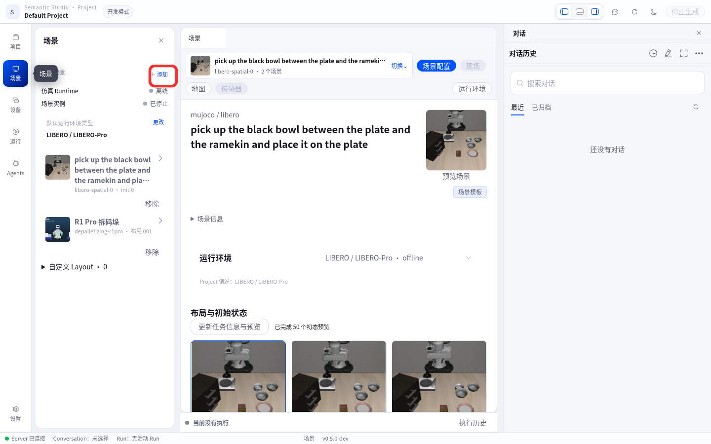
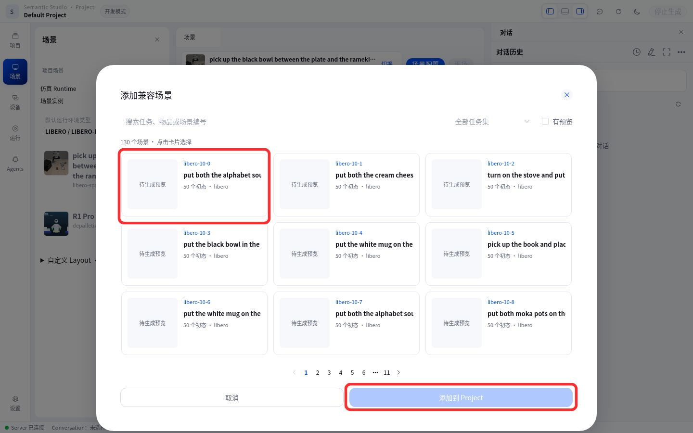
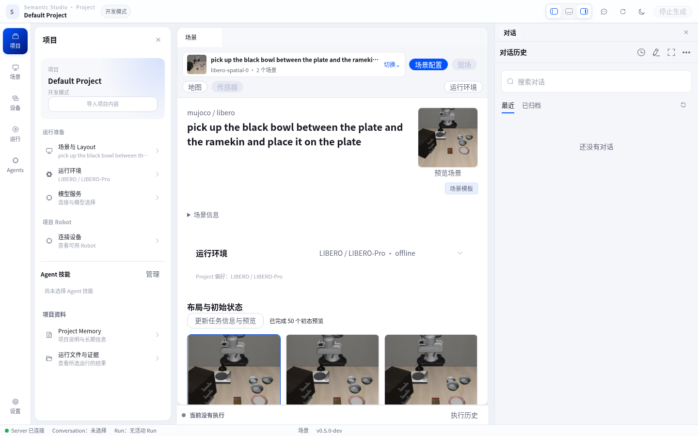
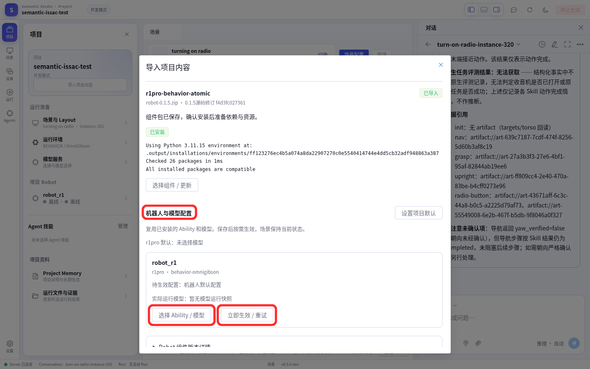
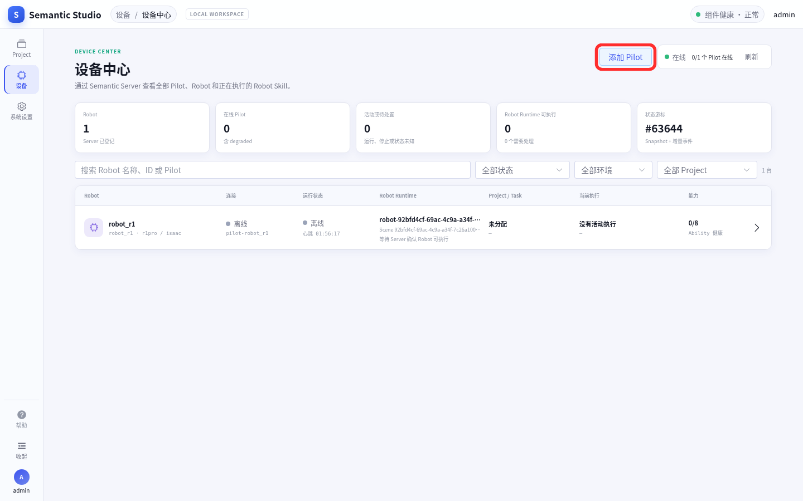
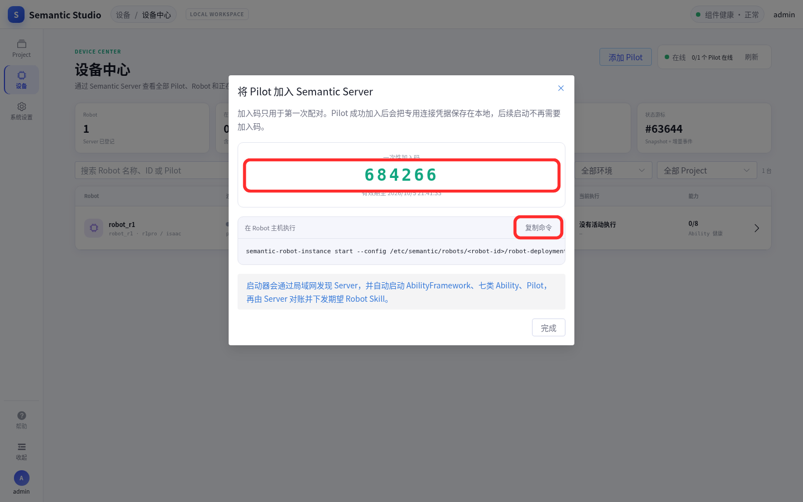

# LIBERO 扩展场景 — 用户操作手册

[English](README.md) | **简体中文**

LIBERO 是一套桌面操作 benchmark（robosuite 1.4 + Franka + SmolVLA）。本手册带你从零把
LIBERO 场景装进 Semantic，并在 Web Studio 里把机器人跑起来。按三条主线走：

```text
① 环境准备 → ② 安装到框架 → ③ 在 Web 上复刻
```

> 只要基础环境装好，LIBERO 的**代码类**产物是**自足**的：不需要引擎镜像。
> **场景数据集不随本通道分发**，需你按上游许可自行获取 `libero-scenes.zip`（见 [1.2](#12-场景数据集与模型权重)）。

---

## 0. 全流程总览

```text
① 基础环境        install.sh（不装扩展）→ 可用的 Server + Studio
② 装 LIBERO       install.sh --extension libero --extension-project <项目ID>
③ Web 复刻         场景配置 → 添加兼容场景；项目内容 → 绑定 Ability 与模型；设备中心 → 添加 Pilot
④ 验收             选初态 → 启动场景 → 机器人上线 → 下发展望的 Robot Skill
```

固定安装顺序：**Runtime → 场景 → 运行支持 → Ability → 模型 → Skill**。运行支持（Bundle）是底座，
后三者往它上面插，倒序装不上去。这个顺序由清单约束，`install.sh` / `semanticctl` 会自动遵守。

---

## 1. 环境准备

### 1.1 硬件与系统

| 项 | 要求 | 说明 |
|---|---|---|
| CPU / 内存 | 建议 16 GB 内存以上 | 核显也能跑，只是推理慢 |
| 磁盘 | 空余约 **25 GB** | 六个产物合计约 11.5 GB，解包后另占一份 |
| GPU | 可选；有独显更快 | **核显可跑**：CPU 推理有自动线程调优（`OMP_NUM_THREADS` 等） |
| 网络 | 能访问 OSS（默认通道） | 走 GitHub 通道时三个大产物仍会回退 OSS，所以**离线请用 `--extension-package-dir`** |

### 1.2 场景数据集与模型权重

**场景数据集（用户自备）。** LIBERO 场景数据集（`libero-scenes.zip`）是上游第三方资产，
**不随本通道分发**（不发 OSS、也不发 GitHub Release）。请按上游许可自行获取（上游 benchmark
`github.com/Lifelong-Robot-Learning/LIBERO` 或其正式镜像），然后指给安装器：

```bash
# 把 libero-scenes.zip 放进本地目录，完全离线安装
install.sh --extension libero --extension-package-dir <目录>
# 安装器按清单里的 sha256/size 逐字节校验，不要用改打包的副本
```

**模型权重（另一项外部依赖）。** SmolVLA 权重从 HuggingFace 取得。**国内直连 huggingface.co
不可达**，用镜像（代理与镜像二选一）：

```bash
export HF_ENDPOINT=https://hf-mirror.com
```

### 1.3 端口

| 用途 | 默认 | 由谁决定 |
|---|---|---|
| LIBERO Runtime | `8092` | 清单 `runtime.endpoint`（与基础环境 native-mujoco 的 `8090` 不同，可并存） |
| Ability 段 | `18100–18199` | `semantic-server.yaml` 的 `ability_port_first` / `ability_port_last` |
| Server HTTP / WS | `8034` / `8035` | `semantic-server.yaml` |
| Web 前端 | `3000` | `semantic-web` |

> **同机并存 BEHAVIOR 与 LIBERO** 时，两者默认都落在 `18100–18199`，要给两套环境分配不同端口段，
> 否则报 `http server bind ... failed`。

---

## 2. 安装到框架

同一个入口脚本，基础环境装完后自动继续装扩展：

```bash
curl -fsSL https://semantic.insightos.cn/install.sh | bash -s -- \
  --extension libero --extension-project <项目ID> --install-system-deps
```

| 参数 | 作用 |
|---|---|
| `--extension libero` | 选择场景（必填） |
| `--extension-project <项目ID>` | 目标 Project；缺省用当前用户的默认项目（组件安装要求项目为 `mode=development`） |
| `--extension-source oss\|github` | 通道，默认 `oss` |
| `--extension-package-dir <目录>` | 用「六产物 + 清单」**完全离线**安装 |
| `--extension-manifest <文件>` | 用本地清单覆盖来源 |
| `--extension-dry-run` | 只打印命令计划，不改动现场 |

装之前可以先看计划：

```bash
curl -fsSL https://semantic.insightos.cn/install.sh | bash -s -- \
  --extension libero --extension-dry-run
```

已经装好基础环境时，也可以直接用内置管理命令：

```bash
semanticctl extension list
semanticctl extension show libero        # 看产物、体积、顺序、许可
semanticctl extension verify libero      # 只下载校验，不落地
semanticctl extension install libero --project <项目ID>
```

> `semanticctl` 不在 PATH 时先 `export PATH="$HOME/.local/share/semantic/bin:$PATH"`（自定义 `--dir` 按实际目录）；
> 基础安装结束时会打印这两行并提示持久化，详见总入口。

---

## 3. 在 Web 上复刻

基础安装的管理员账号是 `admin`，密码随机生成，用 `semanticctl welcome` 查看：

```bash
"$HOME/.local/share/semantic/bin/semanticctl" welcome
```

浏览器打开 Web（默认 `http://127.0.0.1:3000`），用 `admin` 登录，进入目标 Project。装完有**三件事**
必须在 Web 上做，缺一件场景就进不了项目、机器人就起不来。

### 3.1 场景配置 → 添加兼容场景

安装只把场景注册进**场景目录**，不会自动进项目。

1. Studio 左侧进入「场景」→「项目场景」；
2. 点 **添加**（面板为空时是 **浏览场景**）：

   

3. 在「添加兼容场景」对话框里，搜索或滚动到要用的场景卡片（如 `libero-1-0`），点选它（可多选）；
4. 点 **添加到 Project** 完成：

   

> **别全量出图。** 场景目录里 130 个任务 / 6500 个初态，不限定场景会对全部初态逐一出图，非常慢。
> 只加你要用的那几张卡即可；空闲显存低于 6144 MiB 时安装器会**自动**跳过预览出图（无需手动传参），
> 要手动控制可对 `semanticctl extension install` 加 `--no-previews`。

添加后回到「项目场景」，确认场景已出现，且运行环境一栏为 `LIBERO / LIBERO-Pro`，任务初态可直接启动：



### 3.2 项目内容 → 绑定 Ability 与模型

安装把 Ability 与模型**导入**到项目，但**不会自动绑定到机器人**。

1. Studio 左侧「项目」→ **导入项目内容**，把对话框拉到最下面的 **机器人与模型配置** 一节：

   

2. 点 **选择 Ability / 模型**（想设为以后新设备的默认，改点右上角 **设置项目默认**）；
3. 在弹窗里依次选择：
   - **机器人型号**：`franka_panda`；
   - **Ability（同一角色选择一个实现）**：勾选该型号要用的 Ability；
   - **策略模型**：选兼容的已安装模型（如 SmolVLA，模型包 `franka-smolvla-model`）；
4. 点 **保存绑定**；
5. 回到该机器人的卡片，点 **立即生效 / 重试**——这一步会停止并重启该 Robot 的组件一次
   （场景保持当前状态），所以先确认机器人空闲。

> **不绑定的后果**：Ability 停在 `Standby`（`abilityPort: 0`）直到超时，Pilot 一直 `offline`，
> 设备页看不到可执行的机器人。项目默认只对**后续首次绑定**生效，单个 Robot 的选择独立保存。

### 3.3 设备中心 → 添加 Pilot

「设备中心」是机器人的全局观察入口。全新环境设备列表为空，要用一次性加入码把机器人加进来。
注意 **「添加 Pilot」并不直接添加机器人**：它只生成一个一次性加入码，机器人是在**机器人主机**上执行启动
命令、启动器拿加入码换取凭据之后才注册进来的。

1. 顶部菜单进 **设备中心**，点 **添加 Pilot**：

   

2. 对话框给出 **一次性加入码**（6 位数字）和一条启动命令，先复制下来：

   

   - 加入码**只用于第一次配对**，5 分钟过期、只能被领取一次；不要把加入码或之后的凭据提交到仓库。
   - 命令形态：`semantic-robot-instance start --config /etc/semantic/robots/<robot-id>/robot-deployment.yaml --join-code <加入码>`

3. 到 **Robot 主机**上执行这条命令（前台常驻）。启动器会：
   - 通过局域网（mDNS，服务名 `_semantic-server._tcp`）发现 Server；容器网络里 mDNS 常不可用，
     可显式追加 `--server-http http://<server>:8034 --server-ws ws://<server>:8035/ws/pilot`；
   - 用加入码调 `POST /api/v1/pilot-enrollments/claim` 换取该 Pilot 的专用凭据，写入实例目录的
     `connection.yaml`（权限 `0600`）；
   - 按顺序拉起 **AbilityFramework → 七类 Ability → Pilot**，再由 Server 对账并下发期望的 Robot Skill。

4. 回到设备中心点 **完成**——它只是关窗，配对在启动器领取加入码那一刻就完成了；稍等片刻，机器人应出现在列表里、
   连接状态 **在线**。

之后重启机器人**不再需要加入码**（凭据已保存在 Robot 主机本地）：

```bash
semantic-robot-instance start --config /etc/semantic/robots/<robot-id>/robot-deployment.yaml
```

核对实例自身状态：

```bash
semantic-robot-instance status --instance ~/.local/state/semantic/robots/<robot-id>
# 期望 status: running、pilot_pid 非零、ability_instance_ids 共 7 个
```

### 3.4 验收

按顺序确认：

1. **场景**：在「项目场景」里能选初态、能启动场景；
2. **设备**：设备中心里 Pilot 在线、AbilityFramework ready、需要的 Robot Skill 已启用、Robot 空闲；
3. **执行**：在场景里下发展望的 Robot Skill，能在「当前执行 / 执行历史」看到事件，机器人现场有动作。

> **Pilot 在线 ≠ 机器人可执行**。若设备中心显示 Pilot 在线但 Robot 不可执行，继续查 AbilityFramework、
> 七类 Ability、Robot Skill 的期望/实际状态与 Project 占用，不要只看 Pilot 心跳。

---

## 4. 常见故障

| 现象 | 原因与处理 |
|---|---|
| `Runtime 安装失败: ... 需要内容 ...` | Runtime 包缺内容；LIBERO 不需要 `--asset-root`，别传空值 |
| `http server bind ... failed` | Ability 端口段与别的场景冲突，换 `--extension-project` 对应环境的端口段 |
| 项目里看不到场景 | 没做「添加兼容场景」（3.1） |
| 机器人永远 `offline` / Ability 停在 `Standby` | 没绑定 Ability 与模型（3.2），或设备中心还没加 Pilot（3.3） |
| 模型下载失败 | HuggingFace 直连不可达，设 `HF_ENDPOINT=https://hf-mirror.com` |
| 场景出图极慢 | 对 6500 个初态全量出图；只加需要的场景，或对 `semanticctl extension install` 加 `--no-previews` |

排障与验收可以只下载校验：

```bash
semanticctl extension verify libero --source oss
```

---

## 5. 卸载

先停场景与 Robot，再卸载扩展。基础环境的 native-mujoco Runtime 不受影响
（`installation_id` 与 endpoint 各自独立）：

```bash
semanticctl extension remove libero
```

---

## 参考

### 六个产物

| 角色 | 产物 | 体积 | 通道 |
|---|---|---|---|
| `runtime` | `semantic-libero-robosuite-1.4-0.4.0-dev.0.runtime.tar.zst` | 约 2.2 GB | OSS + GitHub |
| `scene_catalog` | `libero-scenes.zip` | 约 239 MB | **不分发，用户自备**（见 [1.2](#12-场景数据集与模型权重)） |
| `robot_base` | `franka-libero-robot.zip` | 约 2.9 GB | 仅 OSS（>2 GiB） |
| `robot_ability` | `franka-ability.zip` | 约 2.9 GB | 仅 OSS（>2 GiB） |
| `model` | `franka-smolvla-model.zip` | 约 3.3 GB | 仅 OSS（>2 GiB） |
| `robot_skill` | `vla-manipulation.zip` | 约 12 KB | OSS + GitHub |

Runtime 的 `installation_id` 是 `local-libero-robosuite-1.4`，endpoint 固定 `8092`。

### 许可

LIBERO 是上游第三方 benchmark（`github.com/Lifelong-Robot-Learning/LIBERO`）。**场景数据集不随
本通道分发**，需你按上游许可单独获取，与 BEHAVIOR 数据集同一原则。代码类产物带 `license`
字段，安装器据此自动补 `--accept-license LIBERO`（也可显式传）。不要因为「能下载」就默认可
再分发，也不要把场景数据集上传到 OSS 或 GitHub Release。

### 设计依据

清单结构、通道布局与发布流程见 [`../../docs/extensions.zh-CN.md`](../../docs/extensions.zh-CN.md)；
总入口与目录约定见 [`../README.zh-CN.md`](../README.zh-CN.md)。
